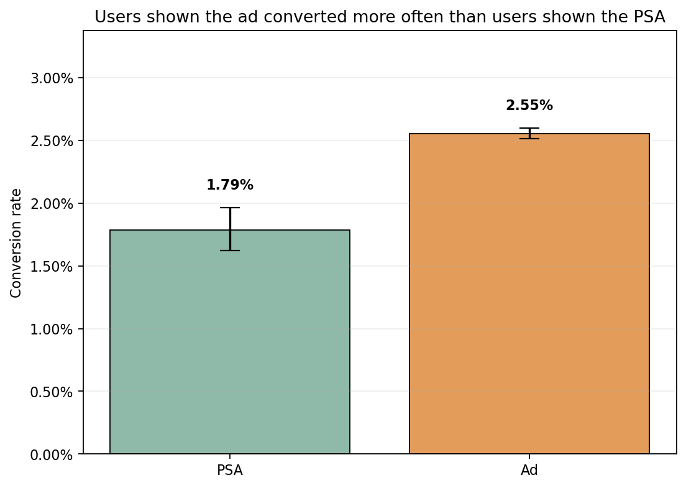
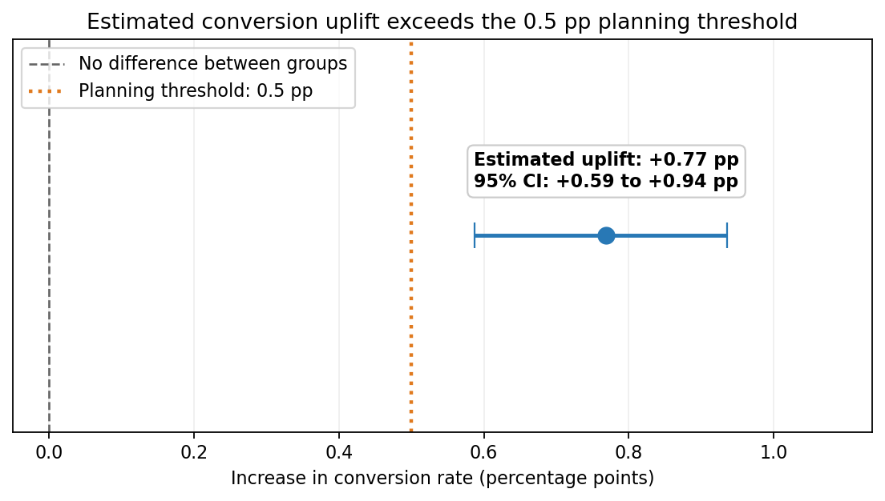
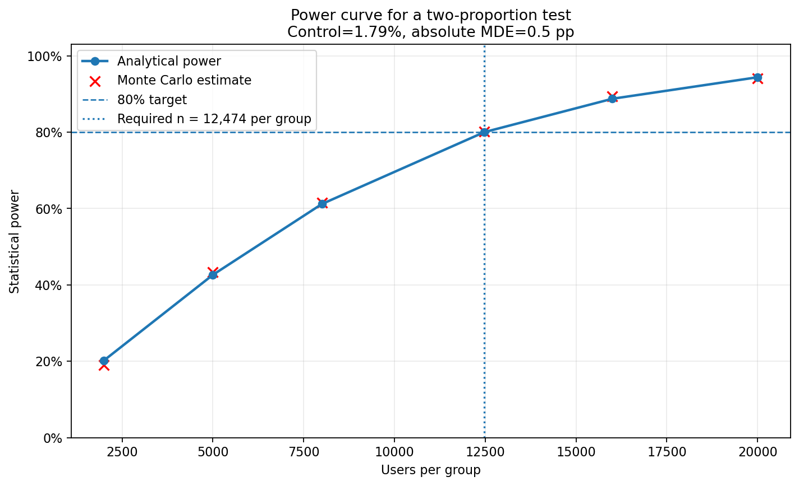
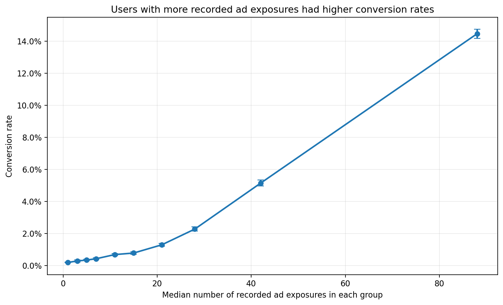

# Marketing A/B Test Analysis

I analyzed a marketing A/B test comparing an advertisement (`ad`) group with a public-service announcement (`psa`) group.

I used SQLite for data validation and Python for statistical analysis. I also used power analysis and Monte Carlo simulation to examine how a future experiment could be planned.

## Project goal

The main question was:

> Does the ad group have a higher conversion rate than the PSA group, and is the difference large enough to matter in practice?

The dataset does not include advertising costs, revenue, dates, or experiment-assignment logs, so the final recommendation is conditional.

## Key results

The dataset contains **588,101 unique users** with no duplicate user IDs or missing values in the required columns.

| Metric | Result |
|---|---:|
| Users in ad group | 564,577 |
| Users in PSA group | 23,524 |
| Ad conversion rate | 2.55% |
| PSA conversion rate | 1.79% |
| Absolute uplift | **+0.77 pp** |
| Relative uplift | **+43.1%** |
| 95% CI for absolute uplift | **+0.59 to +0.94 pp** |
| Two-sided z-test p-value | **1.71 × 10⁻¹³** |
| Scenario MDE | 0.50 pp |
| Detectable uplift at 80% power with observed allocation | ~0.26 pp |

The ad group had a higher conversion rate than the PSA group. The confidence interval does not include zero, and the estimated uplift is larger than the 0.50 percentage-point threshold used in the experiment-planning scenario.





## Conclusion

The results support the ad as the better-performing variant, but I would not make a final rollout decision based on this dataset alone.

Before making a production decision, I would verify:

- whether assignment to the experiment groups was randomized correctly;
- whether conversion tracking was consistent between groups;
- whether the value of additional conversions exceeds the advertising cost;
- whether the effect remains stable over time and across important user segments.

## Analysis

### Data validation

I performed the initial data-quality checks in SQLite using DBeaver.

The SQL scripts check:

- row counts and unique users;
- duplicate user IDs;
- missing values;
- valid experiment groups and conversion values;
- exposure, weekday, and hour ranges;
- group sizes and traffic allocation;
- conversion rates by experiment group.

### Experiment design

I used the observed PSA conversion rate as a baseline proxy for planning a future balanced experiment.

The scenario assumes:

- baseline conversion rate: ~1.79%;
- absolute MDE: 0.50 pp;
- significance level: 0.05;
- target power: 80%;
- allocation: 1:1.

Under these assumptions, the required sample size is approximately **12,474 users per group**.

I also ran a Monte Carlo simulation to check whether the simulated power was close to the analytical result.

The 0.50 pp MDE is a planning assumption, not a universal business threshold. In a real business setting, I would derive it from conversion value, margin, advertising cost, traffic volume, and the cost of delaying a decision.



### Observed experiment

Because conversion is a binary outcome, I used a **two-proportion z-test** to compare the groups.

I reported:

- conversion rates for both groups;
- absolute and relative uplift;
- a 95% confidence interval for the absolute difference;
- the two-sided p-value;
- the smallest uplift detectable with 80% power under the observed group allocation.

I also translated the estimated uplift into additional conversions under clearly defined traffic scenarios.

### Exposure analysis

I explored the relationship between the recorded number of ad exposures and conversion within the ad group.

Users with more recorded exposures converted more often, but I did **not** interpret this relationship as causal. Exposure frequency was not randomized and may also depend on targeting, user engagement, time at risk, or campaign-delivery rules.



## Repository structure

```text
ab_test_project/
├── data/
│   └── raw/
│       └── marketing_AB.csv
├── notebooks/
│   ├── 01_monte_carlo_design.ipynb
│   ├── 02_real_data_analysis.ipynb
│   └── 03_exposure_association.ipynb
├── sql/
│   ├── aggregate_groups.sql
│   └── validation.sql
├── visuals/
│   ├── conversion_rates.png
│   ├── effect_estimate.png
│   ├── exposure_conversion_association.png
│   └── power_curve.png
├── README.md
└── requirements.txt
```

## Dataset

The project uses the [Marketing A/B Testing dataset](https://www.kaggle.com/datasets/faviovaz/marketing-ab-testing) published on Kaggle.

The main variables are:

| Column | Description |
|---|---|
| `user id` | Unique user identifier |
| `test group` | `ad` or `psa` experiment group |
| `converted` | Whether the user converted |
| `total ads` | Recorded number of exposures |
| `most ads day` | Day with the highest number of exposures |
| `most ads hour` | Hour with the highest number of exposures |

## Running the project

Create a virtual environment:

```bash
python -m venv .venv
```

Activate it:

```bash
# Windows PowerShell
.venv\\Scripts\\Activate.ps1

# macOS / Linux
source .venv/bin/activate
```

Install the dependencies and start JupyterLab:

```bash
python -m pip install --upgrade pip
pip install -r requirements.txt
jupyter lab
```

Run the notebooks in numerical order.

The SQL scripts use **SQLite syntax** and were run in DBeaver against a local `marketing.db` database.

## Limitations

- The dataset does not confirm that assignment to `ad` and `psa` was randomized.
- There are no dates, so experiment duration, seasonality, and time trends cannot be assessed.
- Revenue, margin, advertising cost, and conversion-quality data are not available.
- The experiment groups are highly imbalanced.
- The exposure-frequency analysis is observational and uses a post-assignment variable.
- The results may not generalize beyond the users and campaign setup represented in the dataset.

## Tools

`SQLite` · `DBeaver` · `Python` · `Jupyter` · `pandas` · `NumPy` · `SciPy` · `statsmodels` · `Matplotlib`
